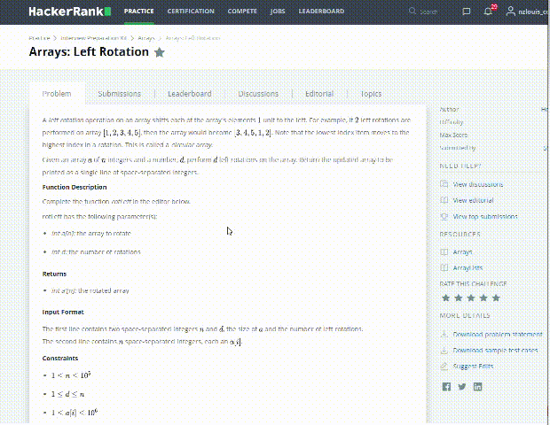

The coding-practice project is one of my projects to practice the Java challenges
that from several large code practice sites. I love learning 
and improving in this way, and it's one of my favorite things 
to do.

# Certificates

